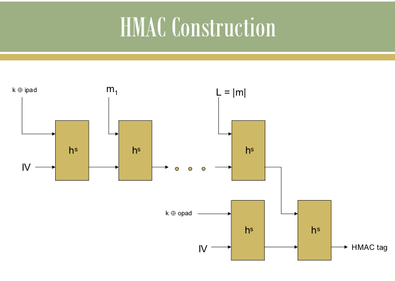

For a very brief overview of the Merkle-Damgård transform and the design of HMAC from fixed length collision resistant hash function, click [here](docs/Collision Resistant Hash Functions.pdf)

Cryptographic hash functions are fundamental building blocks in modern cryptography that transform input data of arbitrary length into fixed-size output called a hash digest. These functions serve multiple purposes in cryptographic systems, from ensuring data integrity to enabling secure authentication mechanisms.

### How Cryptographic Hash Functions Work

1. **Input Processing**: Accept messages of any length (from empty string to gigabytes)
2. **Deterministic Computation**: Always produce the same output for the same input
3. **Fixed Output**: Generate a hash of predetermined length (e.g., SHA-1 produces 160 bits)
4. **Avalanche Effect**: Small input changes cause dramatic output changes

### Essential Security Properties

Secure cryptographic hash functions must satisfy three critical properties:

1. **Pre-image Resistance (One-way)**: Given a hash h, it's computationally infeasible to find message m such that H(m) = h
2. **Second Pre-image Resistance (Weak Collision Resistance)**: Given message m₁, it's infeasible to find m₂ ≠ m₁ such that H(m₁) = H(m₂)
3. **Collision Resistance (Strong Collision Resistance)**: It's infeasible to find any two different messages m₁, m₂ such that H(m₁) = H(m₂)

### HMAC: Hash-based Message Authentication Code

HMAC combines hash functions with secret keys to provide both data integrity and authentication:

#### HMAC Construction

- **Input**: Message M, Secret Key K, Hash Function H
- **Process**: HMAC(K,M) = H((K ⊕ opad) || H((K ⊕ ipad) || M))
- **Output**: Authentication tag that proves message authenticity

#### HMAC Algorithm Steps

1. **Key Padding**: Adjust key length to match hash block size
2. **Inner Padding**: XOR key with ipad (0x36 repeated)
3. **Inner Hash**: Hash the concatenation of padded key and message
4. **Outer Padding**: XOR key with opad (0x5C repeated)
5. **Outer Hash**: Hash the concatenation of outer padded key and inner hash result

### Security Analysis

#### Hash Function Vulnerabilities

Modern hash functions face various attack vectors:

1. **Birthday Attacks**: Exploit the birthday paradox to find collisions faster than brute force
2. **Length Extension Attacks**: Append data to messages without knowing the secret key
3. **Cryptanalytic Attacks**: Mathematical techniques to break specific hash algorithms

#### HMAC Security Advantages

HMAC provides stronger security guarantees:

1. **Key-dependent Security**: Security relies on secret key knowledge
2. **Resistance to Length Extension**: Inner/outer construction prevents extension attacks
3. **Proven Security**: Mathematically proven secure if underlying hash function is secure

### Practical Applications

#### Digital Signatures

Hash functions enable efficient digital signatures by signing hash digests instead of entire messages.

#### Password Storage

Systems store password hashes instead of plaintext passwords for security.

#### Blockchain Technology

Cryptocurrencies use hash functions for proof-of-work and transaction linking.

#### Network Protocols

HMAC secures protocols like TLS, IPSec, and SSH for authenticated communication.

In our experiment, instead of using a full-fledged collision resistant hash function h, we use a simplified "dummy" function h for educational purposes. You are asked to assume collision resistance about the given function h and use it to design HMAC following the standard construction principles.
